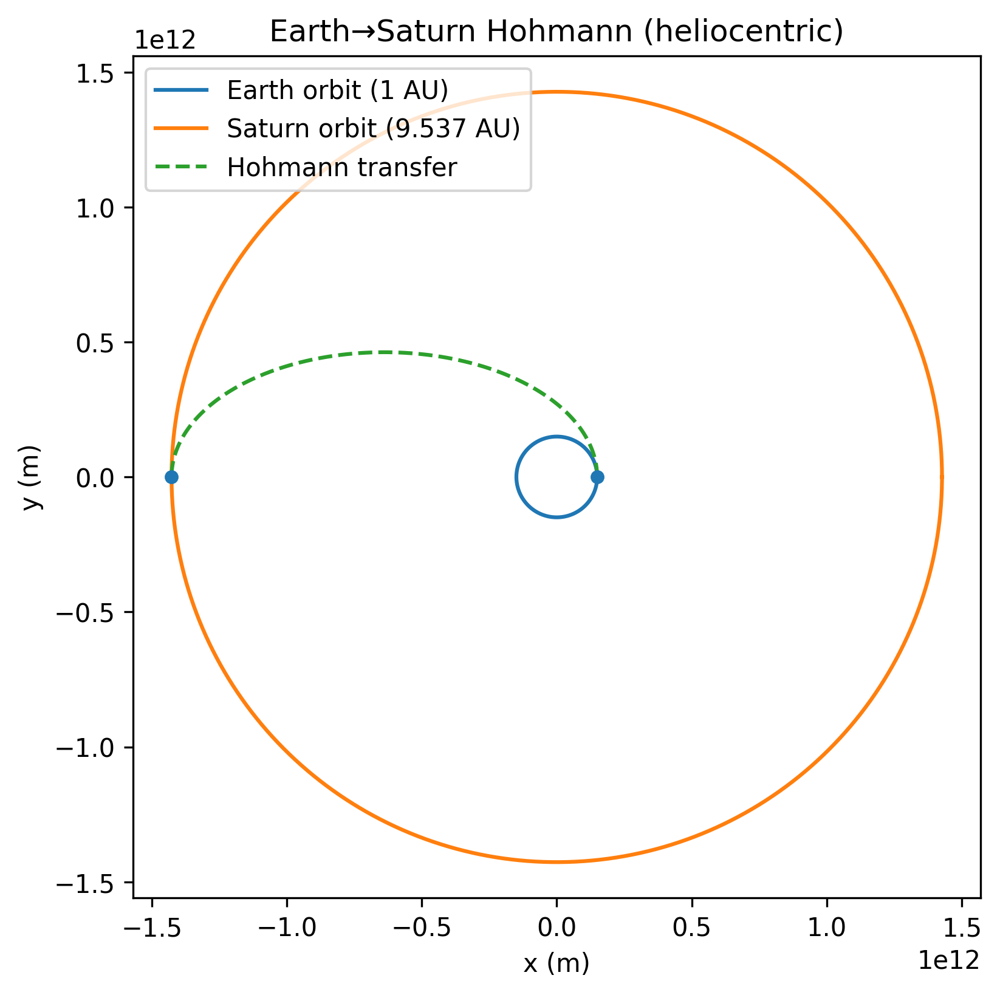
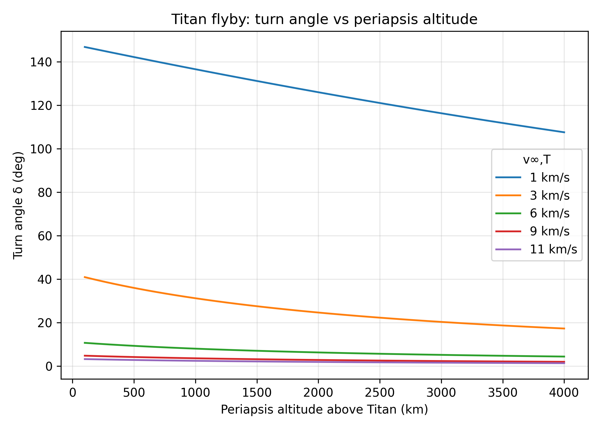
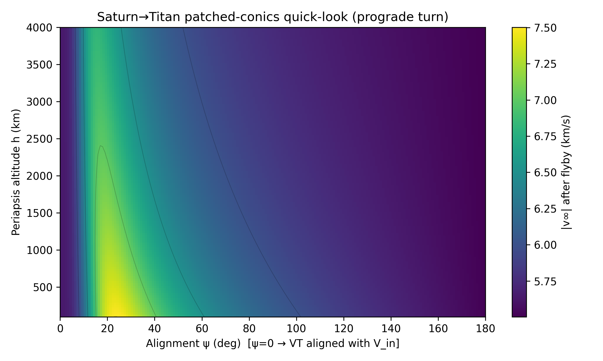
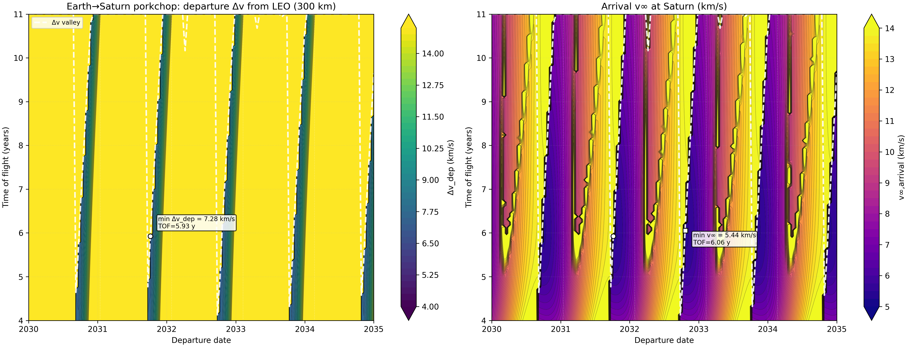

# Titan Mission Design


Mission design and trajectory analysis for **Earth → Saturn → Titan** transfers using patched-conic methods and classical astrodynamics tools.  
This project demonstrates how orbital mechanics and mission planning can be rapidly prototyped in Python, with visual outputs for design review and decision-making.

---

## Highlights for Recruiters
- Implements **Hohmann transfer** analysis and **Lambert solvers** for interplanetary trajectory planning.
- Generates **porkchop plots** of Δv vs. launch date for mission optimization.
- Models **Titan flyby geometry** with post-flyby velocity mapping.
- Demonstrates **patched-conic approximations** with extendable modular codebase.
- Repository structured for **reusability and scalability** in larger mission design projects.

This repository showcases skills in **orbital mechanics, trajectory simulation, numerical methods, and technical communication**—all of which are directly applicable to aerospace engineering roles.

---

## Example Results

### Earth → Saturn Hohmann Transfer


### Titan Flyby Turning Angle


### Titan Flyby Post-Flyby v∞ Mapping


### Porkchop Plot (Earth → Saturn)


---

## Repository Structure

```
titan_proposal/
├── src/                # Core Python modules (constants, patched_conics, plotting, transfers)
├── examples/           # Runnable scripts (Hohmann, Titan flyby, porkchop, etc.)
├── figures/            # Generated plots
├── docs/               # Documentation and presentations
└── README.md           # This file
```

---

## Quick Start

1. Clone this repo:
   ```bash
   git clone https://github.com/YOUR_USERNAME/titan-mission-design.git
   cd titan-mission-design
   ```

2. Install requirements:
   ```bash
   pip install -r requirements.txt
   ```

3. Run an example:
   ```bash
   export PYTHONPATH=src   # (Linux/macOS)
   python examples/porkchop_earth_saturn.py
   ```

4. Figures will appear in the `figures/` folder.

---

## Future Development
- Integrate **real planetary ephemerides** (SPICE/Horizons).
- Implement **multi-rev Lambert solvers**.
- Add **Saturn/Titan capture Δv** analysis.
- Expand to **end-to-end mission scenarios** with multi-body dynamics.

---

## Related Work
This repository supported analyses presented in:  
[Mission Design Paper (PDF)](docs/Proposal%20for%20the%20Geological%20and%20Atmospheric%20Data%20Expansion%20of%20Titan.pdf)

---

## About the Author
This project is part of a portfolio in **orbital mechanics, mission design, and aerospace systems engineering**.  
More projects available at: [GitHub Portfolio](https://github.com/blaketjohnson)
